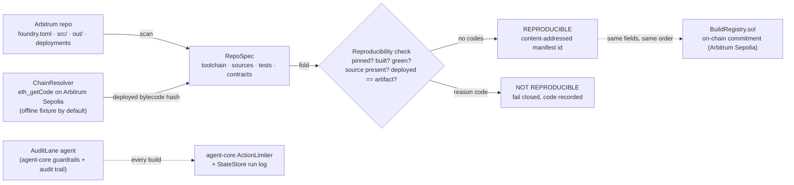
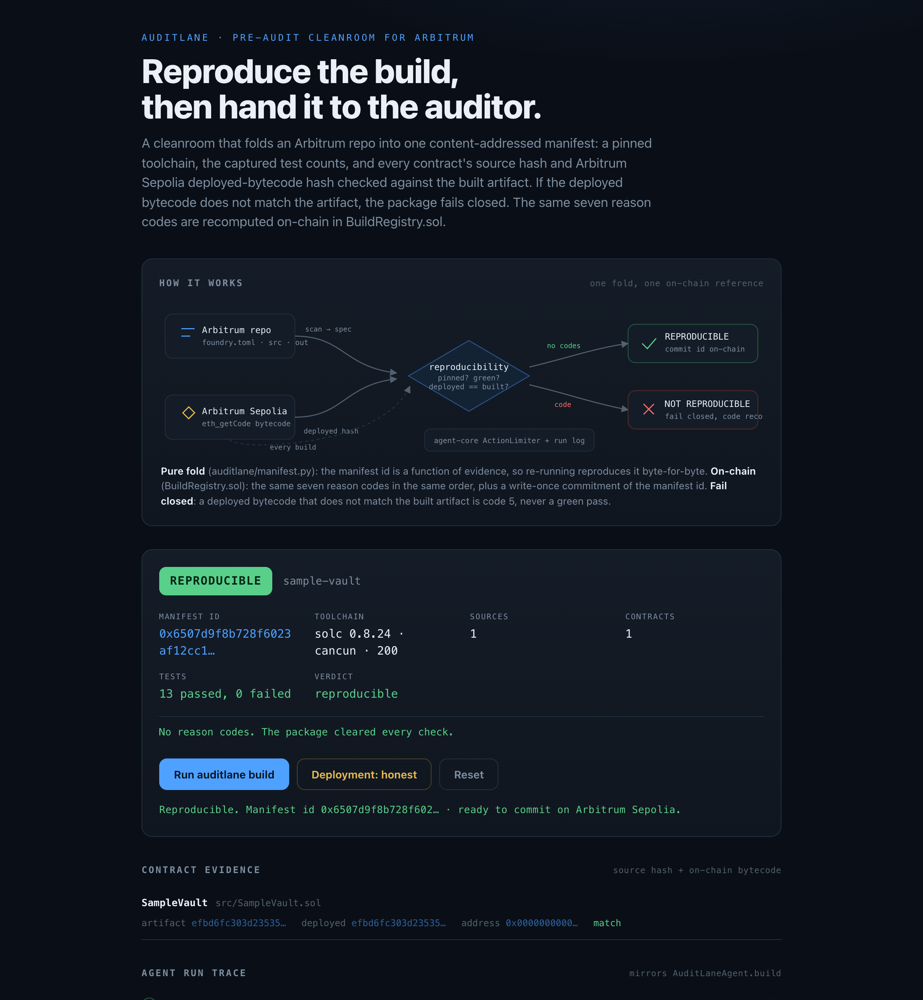

# AuditLane

A **reproducible pre-audit cleanroom** for Arbitrum projects entering the
[Arbitrum Audit Program](https://arbitrum.foundation/). Point `auditlane` at an
Arbitrum repo and it produces a normalised, content-addressed **evidence package** a
whitelisted audit firm can open without reconstructing the build: a pinned toolchain,
the captured test counts, and a manifest of every contract with its source hash and its
Arbitrum Sepolia **deployed-bytecode hash checked against the built artifact**.

The manifest is a pure function of the repo state, so a reviewer re-runs the same
command and gets the **byte-for-byte identical manifest id**. If the deployed bytecode
does not match the artifact, the package fails closed with a reason code. Keyless and
offline by default; the live Arbitrum Sepolia bytecode path gates on `AUDITLANE_RPC_URL`.

**Milestone 1** of the AuditLane application to the Arbitrum Audit Program: the
cleanroom core plus a byte-for-byte on-chain reference (`BuildRegistry.sol`). Arbitrum
Sepolia testnet only, never mainnet.

**[▶ Live demo](https://doom2quake.github.io/auditlane/ui/)**  ·  **[Watch the walkthrough](https://youtu.be/U9ROK9goVF4)**  ·  **[Paper (PDF)](paper/paper.pdf)**  ·  **[Deck (PDF)](deck/deck.pdf)**  ·  Built for the **[Arbitrum Audit Program](https://arbitrum.foundation/)**

Read [docs/LIMITATIONS.md](docs/LIMITATIONS.md) first for the short version of what is
proved, what is simulated, and what is not built. Nothing on this page contradicts it.

## The 30-second demo

```
$ auditlane demo
AuditLane — a reproducible pre-audit cleanroom for the Arbitrum Audit Program (offline demo)

1. A clean Arbitrum repo. AuditLane builds a reproducible package.
  REPRODUCIBLE  sample-vault
    manifest id    0x9f3c...
    toolchain      solc 0.8.24
    sources        1
    contracts      1
    tests          13 passed, 0 failed

contract evidence (source + on-chain bytecode)
  SampleVault    src src/SampleVault.sol
    artifact 4b2f...  deployed 4b2f...  match

2. Re-run the same build. The manifest id is byte-for-byte identical.
    first run     0x9f3c...
    second run    0x9f3c...
    reproducible  yes, identical id

3. A tampered deployment. AuditLane fails the package closed.
  NOT REPRODUCIBLE  sample-vault
    code 5  deployed bytecode does not match the built artifact
```

Step 3 is the one worth pausing on. The cleanroom never emits a green manifest the
reproducibility check did not clear. A deployed contract whose on-chain bytecode does
not match the locally built artifact is not a warning to read past; it is reason code 5
and a `NOT REPRODUCIBLE` verdict. The same seven reason codes, in the same fixed order,
are also computed on-chain in `src/BuildRegistry.sol`, so a firm never has to trust the
tool's word for the verdict.

## Architecture



One pure core, one on-chain reference, one agent wrapper:

- **`auditlane/manifest.py`**: the load-bearing pure fold. It takes a repo's spec
  (pinned toolchain, source files, captured test result, on-chain deployments) and
  produces a single content-addressed manifest. No I/O, no network, no clock:
  everything that varies is passed in, so the `manifest_id` is a function of evidence
  and nothing else. `check` returns the reproducibility reason codes in a **fixed
  order**; an empty list is `REPRODUCIBLE`. The canonical payload field order mirrors
  `BuildRegistry.sol` byte-for-byte.
- **`src/BuildRegistry.sol`**: the on-chain side. `check` computes the same verdict from
  a package's checkable shape with the identical reason codes and order, `manifestDigest`
  recomputes the id from the canonical payload, and `commit` writes a manifest id
  once (re-committing reverts), so a published package can be checked against an
  immutable on-chain claim.
- **`auditlane/scanner.py`**: reads a repo on disk into that spec — the pinned toolchain
  from `foundry.toml`, every `.sol` under `src/` by content hash, each artifact's runtime
  bytecode hash from `out/`, and an `auditlane.deployments.json` mapping contract names to
  Arbitrum Sepolia addresses. It does **not** invent a green test suite: the counts come
  from a captured `auditlane.tests.json`, so the manifest reports the counts that ran.
- **`auditlane/chain.py`**: the Arbitrum chain seam. Offline (default, keyless) it
  returns the deployed bytecode hash from a deterministic in-process fixture; live (gated
  on `AUDITLANE_RPC_URL`) it calls `eth_getCode` on Arbitrum Sepolia via web3.py.
  Read-only either way, and it refuses to resolve against any chain id that is not
  Arbitrum Sepolia (421614).
- **`auditlane/agent.py`**: runs the build as a recorded action wrapped in
  [agent-core](https://github.com/doom2quake) guardrails. The manifest write passes an
  `ActionLimiter`, and every step (scan, resolve, reproducibility check, manifest) is
  journalled in the `StateStore` so the UI can replay the activity log. The agent never
  emits a green manifest a failing check produced.

## Run it

```bash
# the cleanroom (agent-core is vendored under agent_core/, no monorepo install needed)
PYTHONPATH=. python -m auditlane.main demo             # the whole hero story in one run
PYTHONPATH=. python -m auditlane.main build            # build the bundled sample Arbitrum repo
PYTHONPATH=. python -m auditlane.main manifest         # print the full canonical manifest JSON

# the on-chain reference
forge test                                             # 13 Solidity tests on BuildRegistry
```

### Live mode (read-only)

```bash
export AUDITLANE_RPC_URL=https://sepolia-rollup.arbitrum.io/rpc
PYTHONPATH=. python -m auditlane.main build ./path/to/your-arbitrum-repo
```

With `AUDITLANE_RPC_URL` set, the chain seam calls real `eth_getCode` on Arbitrum
Sepolia to read each contract's deployed runtime bytecode, and refuses to run against
any chain id other than Arbitrum Sepolia (421614). It never sends a transaction and
never needs a key. With no RPC set, the deterministic in-process fixture stands in, so
the whole build runs keyless and offline.

## Tests

- `forge test`, **13 Solidity tests** (solc 0.8.24) on `src/BuildRegistry.sol`: the
  reproducibility check for every reason code and its fixed order, the write-once
  commitment, and the keccak digest.
- `PYTHONPATH=. pytest -q`, **24 Python tests**. No env vars or credentials needed; the
  chain seam runs offline. The `test_check_*` cases are the exact analogues of the
  `test*Fails` cases in `test/BuildRegistry.t.sol`, so a green pytest proves the Python
  core agrees with the on-chain reference on every reason code and their order.

Every reason code has a test that fails without the check that raises it. The two suites
read side by side.

## Built for the Arbitrum Audit Program

AuditLane is a candidate entry to the [Arbitrum Audit Program](https://arbitrum.foundation/),
run by the [Arbitrum Foundation](https://arbitrum.foundation/) to subsidise third-party
smart-contract audits for projects building on [Arbitrum](https://arbitrum.io/). It is an
application, not an accepted grant: there is no partnership with the Arbitrum Foundation or
any whitelisted audit firm, no endorsement, and nothing here should be read as one.

The reason it belongs on Arbitrum specifically is the shape of the program. The Audit
Program routes a fixed set of whitelisted firms through rolling, subsidised engagements;
every hour a firm spends reconstructing a project's build before a review starts is
subsidy that bought no security. A reproducible, evidence-carrying package produced
*before* the firm starts turns that reconstruction into a one-command re-run. The manifest
is checked against an on-chain commitment (`BuildRegistry.sol`) on [Arbitrum
Sepolia](https://docs.arbitrum.io/), so the verdict a firm reads is one anyone can
recompute from the published package. Everything here is Arbitrum Sepolia **testnet only**,
with no mainnet deployment and no real funds.

The full milestone-mapped write-up is in [docs/PROPOSAL.md](docs/PROPOSAL.md).

## Paper, deck & UI

- **[Paper (PDF)](paper/paper.pdf):** `paper/paper.tex`, a short technical write-up (rebuild: `tectonic paper/paper.tex`).
- **[Deck (PDF)](deck/deck.pdf):** `deck/deck.md`, a Marp slide deck (rebuild: `marp deck/deck.md --pdf`).
- **[Live demo](https://doom2quake.github.io/auditlane/ui/):** `ui/index.html`, the
  interactive cleanroom demo (also opens offline over `file://`). It runs the real
  reproducibility check in the browser over the bundled sample repo; it shows the real
  manifest fields, reason codes and the on-chain `BuildRegistry` event signature, and
  invents no transaction hashes.
- **Walkthrough video:** [`docs/auditlane-demo.mp4`](docs/auditlane-demo.mp4),
  a narrated tour of the problem, the reproducibility check, the architecture, and the
  grant roadmap (also on [YouTube](https://youtu.be/U9ROK9goVF4)).

[](https://doom2quake.github.io/auditlane/ui/)

## Cite

```bibtex
@software{sarkar_auditlane_2026,
  title   = {AuditLane: A Reproducible Pre-Audit Cleanroom for the Arbitrum Audit Program},
  author  = {Dipankar Sarkar},
  year    = {2026},
  url     = {https://github.com/doom2quake/auditlane},
  license = {MIT}
}
```

## License

MIT, held by doom2quake, see [LICENSE](LICENSE).
